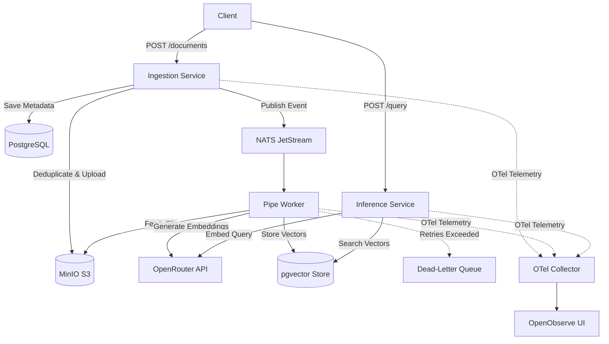

# RAG-Pipe
Event-Driven Document Ingestion and Vector Generation Pipeline

## Abstract

RAG-Pipe is an enterprise-grade document processing and AI search engine designed for scale, speed, and cost efficiency. It automatically extracts, cleans, indexes, and searches complex documents in real time while reducing cloud infrastructure expenses.

---

## Technology Stack

* **Language**: Go (v1.26)
* **Relational & Vector Database**: PostgreSQL (v16) with `pgvector`
* **Object Storage**: MinIO (S3-compatible)
* **Message Broker**: NATS JetStream
* **Telemetry Collector**: OpenTelemetry Collector
* **Observability UI**: OpenObserve
* **Containerization**: Docker & Docker Compose
* **Orchestration**: Kubernetes
* **Database Migrations**: Liquibase

---

## Key Product Capabilities

* **Automatic Multi-Language Detection & Processing**: Supports global document processing with automatic natural language identification (75+ languages via Lingua), ISO language metadata tagging, and multilingual vector search capabilities out of the box.
* **Intelligent Token-Aware Document Chunking**: Supports exact token slicing, paragraph-aware, sentence-aware, and character-based window strategies powered by `tiktoken` for maximum AI search accuracy and context quality.
* **Concurrent Multi-Document Processing**: Built to process several documents simultaneously in parallel, scaling worker channels dynamically to handle heavy concurrent workloads without queue lockups.
* **Dramatically Lowers AI & Cloud Costs**: Intelligently identifies duplicate document uploads before processing. Eliminates repetitive file storage, background processing, and expensive AI API fees.
* **Handles Massive Upload Volumes Without Slowing Down**: Separates file uploads from background processing, allowing your system to stay fast and responsive even when uploading thousands of heavy documents at once.
* **Self-Healing & Error Proof**: Automatically retries transient network glitches in the background and safely isolates broken files so your system never crashes or gets stuck.
* **Complete System Visibility**: Gives your team real-time dashboards to track performance, processing speeds, system health, and operational costs.
* **Built for Multi-Tenant SaaS & Enterprises**: Keeps data strictly separated and secure per customer or organization out of the box.
* **Lightning Fast Performance**: Built for speed with low memory requirements, ensuring fast processing times and low hosting bills.

---

## Architecture Diagram



---

## Quickstart

### Docker Compose

```bash
cp .env.example .env
# Set OPENROUTER_API_KEY in .env
docker compose up -d --build
```

### Kubernetes

```bash
kubectl apply -f k8s/00-namespace.yaml
kubectl apply -f k8s/01-secrets-configmap.yaml
kubectl apply -f k8s/02-postgres.yaml
kubectl apply -f k8s/03-minio.yaml
kubectl apply -f k8s/04-nats.yaml
kubectl apply -f k8s/01-migration-job.yaml
kubectl apply -f k8s/05-ingestion.yaml
kubectl apply -f k8s/06-pipe.yaml
kubectl apply -f k8s/07-inference.yaml
```

---

## API Endpoints

### 1. Document Upload

```bash
curl -X POST http://localhost:8080/api/v1/documents \
  -F "name=Doc" \
  -F "file=@/path/to/file.pdf"
```

### 2. Semantic Search

```bash
curl -X POST http://localhost:8081/api/v1/query \
  -H "Content-Type: application/json" \
  -d '{"query": "distributed queue", "top_k": 3}'
```

---

## License & Maintainers

* **License**: MIT License. See [LICENSE](file:///c:/Users/brian.oyamo.CSMCORP/Projects/Personal/rag-pipe/LICENSE).
* **Maintainer**: Brian Oyamo
