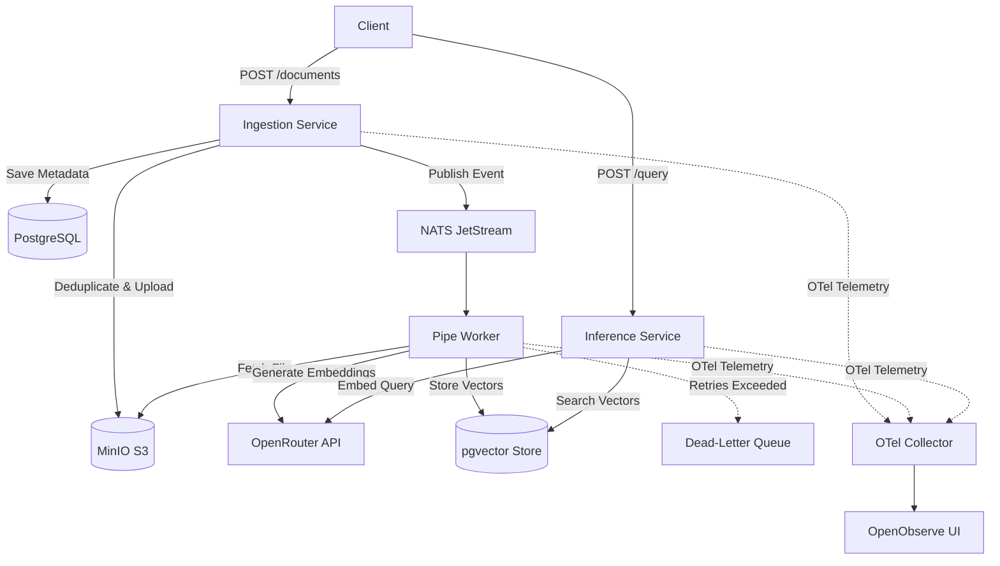

# RAG-Pipe: Event-Driven Document Ingestion and Vector Search Pipeline

## Abstract

RAG-Pipe is a distributed document ingestion and vector search engine written in Go. It decouples API ingress from document processing and embedding generation using NATS JetStream. The platform features SHA-256 deduplication, exponential retries, Dead-Letter Queues (DLQ), and OpenTelemetry (Traces, Metrics, Logs) context propagation.

---

## Technology Stack

* **Language**: Go (v1.26)
* **Relational & Vector Database**: PostgreSQL (v16) with `pgvector`
* **Object Storage**: MinIO (S3-compatible)
* **Message Broker**: NATS JetStream
* **Telemetry Collector**: OpenTelemetry Collector
* **Observability UI**: OpenObserve
* **Containerization**: Docker & Docker Compose
* **Orchestration**: Kubernetes
* **Database Migrations**: Liquibase

---

## Architecture Diagram



---

## Features

* **Event-Driven Architecture**: Decouples API ingress from background processing via NATS JetStream.
* **SHA-256 Deduplication**: Prevents duplicate document storage and redundant embedding computation.
* **Fault Tolerance**: Automatic retry backoff with Dead-Letter Queue (DLQ) routing.
* **OpenTelemetry Observability**: End-to-end W3C trace context, metrics, and structured log aggregation.

---

## Quickstart

### Docker Compose

```bash
cp .env.example .env
# Set OPENROUTER_API_KEY in .env
docker compose up -d --build
```

### Kubernetes

```bash
kubectl apply -f k8s/00-namespace.yaml
kubectl apply -f k8s/01-secrets-configmap.yaml
kubectl apply -f k8s/02-postgres.yaml
kubectl apply -f k8s/03-minio.yaml
kubectl apply -f k8s/04-nats.yaml
kubectl apply -f k8s/01-migration-job.yaml
kubectl apply -f k8s/05-ingestion.yaml
kubectl apply -f k8s/06-pipe.yaml
kubectl apply -f k8s/07-inference.yaml
```

---

## API Endpoints

### 1. Document Upload

```bash
curl -X POST http://localhost:8080/api/v1/documents \
  -F "name=Doc" \
  -F "file=@/path/to/file.pdf"
```

### 2. Semantic Search

```bash
curl -X POST http://localhost:8081/api/v1/query \
  -H "Content-Type: application/json" \
  -d '{"query": "distributed queue", "top_k": 3}'
```

---

## License & Maintainers

* **License**: MIT License. See [LICENSE](file:///c:/Users/brian.oyamo.CSMCORP/Projects/Personal/rag-pipe/LICENSE).
* **Maintainer**: Brian Oyamo
